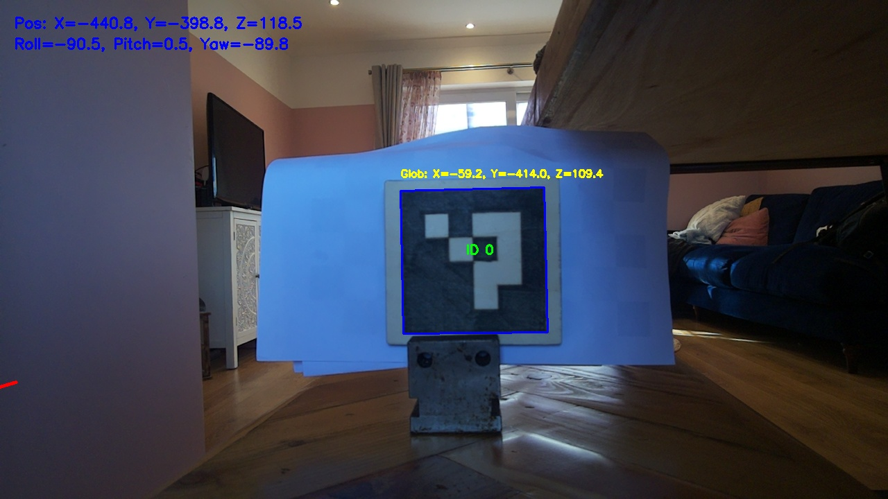

# VEX RPI GPS

The idea behind this is that the Robot knows where it is based on what it can see.

If the robot can see the ArUco marker, it can look up the location and angle data for that marker. Depending on the viewing angle and size of the marking in view calculations can be made to work out where the robot is in relation to the marker.

# Problems

OpenCV python libray, has the coordinate system, where the Markers distance away from the camera as Z, the left right and the x axis and the y as up and down. Code has already been writen for the V5 Brain, where the floor is the x y, ie west to east would be the x and the y would be south to north. also if we have ArUco markers on diffent walls, ie the west wall and the east wall, the coridinate systems will become un manigible.

In the world of OpenCV, the pose of an object is the objects rotation and orientation in some coordinate system in relation to the camera. Everything is in releation to the camera, this makes it very difficult to reverse the sistuation and make the cameras location the variable in the 3d space.